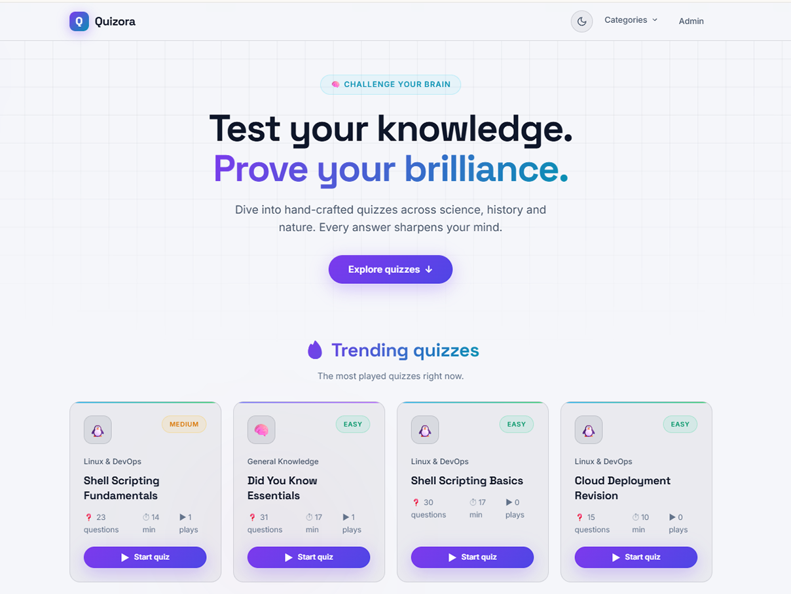
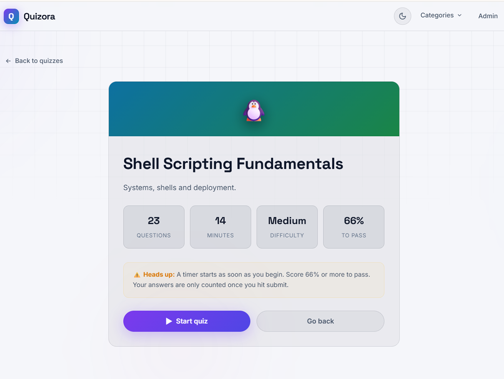
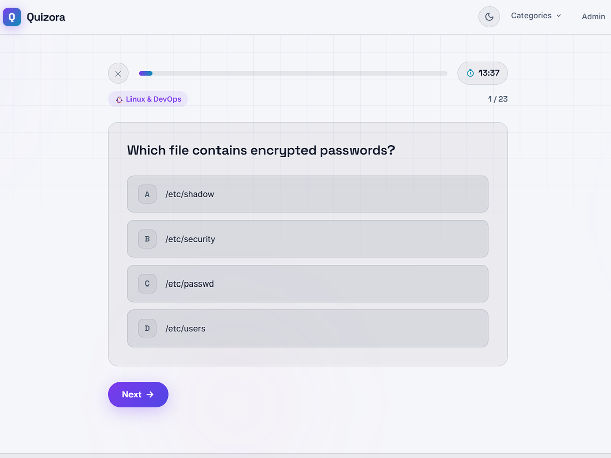
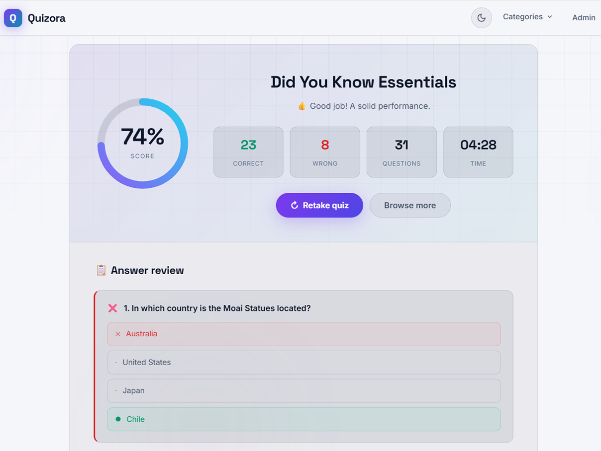
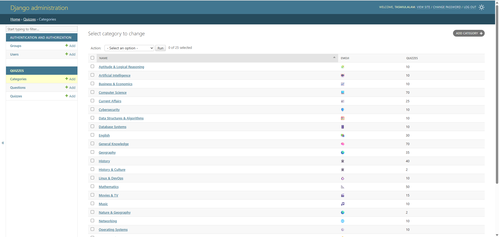
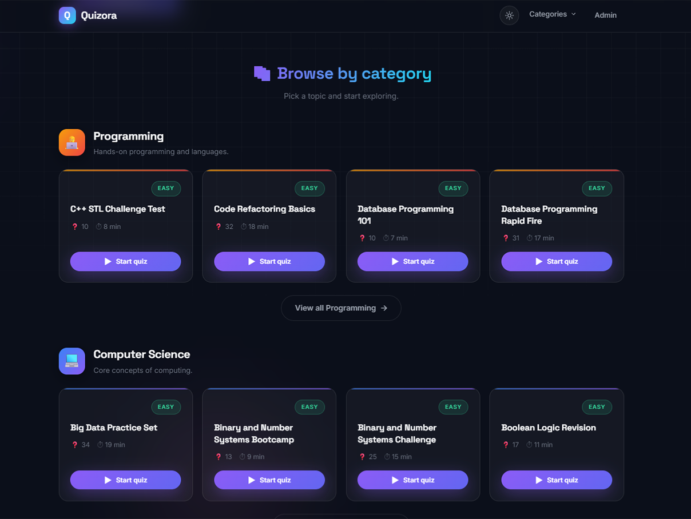

# Quizora - Quiz Portal

A modern, responsive quiz platform built with Django and vanilla JavaScript. Quizora lets visitors browse quizzes by category, play timed quizzes, submit answers, and review their results in an interactive interface.

> **Project Status:** Active Development  
> **License:** MIT

<!-- Add the main application screenshot here. Suggested file: Screenshots/homepage.png -->


## Table of Contents

- [Features](#features)
- [Tech Stack](#tech-stack)
- [Project Structure](#project-structure)
- [Quick Start](#quick-start)
- [Seed Quiz Data](#seed-quiz-data)
- [Admin Panel](#admin-panel)
- [API Reference](#api-reference)
- [Development Notes](#development-notes)
- [License](#license)

## Features

### Quiz Discovery

- Homepage with trending quizzes ordered by play count
- Featured quizzes grouped by category
- Category dropdown with quiz counts
- Dedicated category pages with pagination
- Search and category filtering through the quiz API
- Quiz cards showing difficulty, question count, duration, and play count

<!-- Screenshot slot: Screenshots/homepage.png -->


### Timed Quiz Experience

- Quiz introduction screen with description and rules
- Configurable duration for each quiz
- Progress bar and question counter
- Previous and next question navigation
- Answer selection with validation before moving forward
- Automatic submission when the timer expires
- Quit confirmation to prevent accidental loss of progress

<!-- Screenshot slot: Screenshots/quiz-intro.png -->


<!-- Screenshot slot: Screenshots/quiz-play.png -->


### Results and Review

- Percentage score with animated score ring
- Correct, wrong, total, and elapsed-time statistics
- Question-by-question answer review
- Correct and selected-wrong answers highlighted clearly
- Retake quiz and browse-more actions
- Confetti animation for strong results

<!-- Screenshot slot: Screenshots/quiz-results.png -->


### Content Management

- Django admin interface for categories, quizzes, questions, and choices
- Inline question management inside the quiz editor
- Inline choice management inside the question editor
- Quiz search, filtering, publishing toggle, and slug generation
- Category quiz counts in the admin list
- Management commands for demo and large quiz-bank data

<!-- Screenshot slot: Screenshots/admin-panel.png -->


### UI and Accessibility Details

- Responsive layout for desktop and mobile screens
- Light and dark themes with browser local-storage persistence
- CSS animations, gradients, loading skeletons, and toast messages
- Keyboard-friendly buttons and semantic navigation elements
- Google Fonts: Space Grotesk and Inter

<!-- Screenshot slot: Screenshots/dark-mode.png -->


## Tech Stack

| Layer | Technology |
|-------|------------|
| Backend | [Django 5.2.13](https://www.djangoproject.com/) |
| Language | Python 3.10+ |
| Database | SQLite3 for local development |
| Frontend | HTML, CSS, and vanilla JavaScript |
| Fonts | Space Grotesk and Inter via Google Fonts |
| API | Django JSON responses and browser Fetch API |
| Admin | Django built-in admin |

## Project Structure

```text
Quiz Portal/
├── quizportal/                         # Django project configuration
│   ├── settings.py                     # Settings and database configuration
│   ├── urls.py                         # Main URL router
│   ├── asgi.py                         # ASGI entry point
│   └── wsgi.py                         # WSGI entry point
├── quizzes/                            # Quiz application
│   ├── admin.py                        # Admin registrations and inline editors
│   ├── models.py                       # Category, Quiz, Question, and Choice
│   ├── urls.py                         # JSON API routes
│   ├── views.py                        # HTML views and API endpoints
│   └── management/commands/            # Data seeding commands
│       ├── seed_quizzes.py             # Small demo dataset
│       ├── seed_quiz_bank.py           # Large generated quiz bank
│       └── quiz_bank_data.py           # Quiz bank source data
├── templates/
│   ├── index.html                      # Single-page quiz interface
│   └── category.html                   # Category listing page
├── static/
│   ├── css/styles.css                  # Application styles and themes
│   └── js/                             # Frontend behavior
│       ├── app.js                      # API calls and quiz interactions
│       └── theme.js                    # Theme persistence and toggle
├── requirements.txt                    # Python dependencies
├── manage.py                           # Django management entry point
└── README.md
```

## Quick Start

### Prerequisites

- Python 3.10 or newer
- pip

### Installation

```bash
# Clone the repository
git clone <your-repository-url>
cd Quiz-Portal

# Create and activate a virtual environment
python -m venv env

# Windows PowerShell
env\Scripts\Activate.ps1

# Windows Command Prompt
env\Scripts\activate.bat

# macOS or Linux
source env/bin/activate

# Install dependencies
pip install -r requirements.txt
```

### Create the Database

The repository currently does not include generated app migration files. Create them locally before the first run:

```bash
python manage.py makemigrations quizzes
python manage.py migrate
```

Create an administrator account:

```bash
python manage.py createsuperuser
```

Start the development server:

```bash
python manage.py runserver
```

Open [http://127.0.0.1:8000/](http://127.0.0.1:8000/) in a browser. The admin panel is available at [http://127.0.0.1:8000/admin/](http://127.0.0.1:8000/admin/).

## Seed Quiz Data

Use the smaller demo dataset for quick local testing:

```bash
python manage.py seed_quizzes
```

Use the generated quiz bank for a larger content set:

```bash
python manage.py seed_quiz_bank
```

The quiz-bank command supports a reproducible random seed and reset option:

```bash
python manage.py seed_quiz_bank --seed 42
python manage.py seed_quiz_bank --seed 42 --reset
```

Run only one seed command unless you intentionally want both datasets in the same database.

## Admin Panel

1. Create a superuser with `python manage.py createsuperuser`.
2. Open `/admin/` and sign in.
3. Create categories with a name, slug, emoji, description, and gradient colors.
4. Create quizzes and assign them to categories.
5. Add questions from the quiz editor using the inline question form.
6. Add choices from the question editor and mark one choice as correct.
7. Use `is_published` to control whether a quiz appears publicly.

The public quiz experience does not require visitor accounts. Quiz attempts are counted whenever a submitted quiz is processed.

## API Reference

All API endpoints return JSON.

| Method | Endpoint | Description |
|--------|----------|-------------|
| `GET` | `/api/categories/` | List categories and published quiz counts |
| `GET` | `/api/home/` | Return trending quizzes and featured category data |
| `GET` | `/api/quizzes/` | List published quizzes |
| `GET` | `/api/quizzes/?category=<slug>` | Filter quizzes by category |
| `GET` | `/api/quizzes/?q=<text>` | Search quiz titles |
| `GET` | `/api/quizzes/<id>/` | Return quiz details, questions, and choices |
| `POST` | `/api/quizzes/<id>/submit/` | Score submitted answers and increment attempts |

Example submission:

```json
{
  "answers": [
    {"question_id": 1, "choice_id": 4},
    {"question_id": 2, "choice_id": 7}
  ]
}
```

The submission response includes the score, correct answer count, total questions, answered count, and a complete answer review.

## Development Notes

- The SQLite database file `db.sqlite3` is intentionally not required for a fresh checkout.
- Generated migration files are not committed in the current project state; run `makemigrations` before `migrate` on a new checkout.
- Django's built-in migrations remain required for installed Django applications such as admin, auth, sessions, and content types.
- Do not commit the local virtual environment or generated database file.
- Run the Django system checks before opening a pull request:

```bash
python manage.py check
python manage.py test
```

## License

This project is licensed under the MIT License.

```text
MIT License

Copyright (c) 2026 Tasmiul Alam Shopnil 

Permission is hereby granted, free of charge, to any person obtaining a copy
of this software and associated documentation files (the "Software"), to deal
in the Software without restriction, including without limitation the rights
to use, copy, modify, merge, publish, distribute, sublicense, and/or sell
copies of the Software, and to permit persons to whom the Software is
furnished to do so, subject to the following conditions:

The above copyright notice and this permission notice shall be included in all
copies or substantial portions of the Software.

THE SOFTWARE IS PROVIDED "AS IS", WITHOUT WARRANTY OF ANY KIND, EXPRESS OR
IMPLIED, INCLUDING BUT NOT LIMITED TO THE WARRANTIES OF MERCHANTABILITY,
FITNESS FOR A PARTICULAR PURPOSE AND NONINFRINGEMENT. IN NO EVENT SHALL THE
AUTHORS OR COPYRIGHT HOLDERS BE LIABLE FOR ANY CLAIM, DAMAGES OR OTHER
LIABILITY, WHETHER IN AN ACTION OF CONTRACT, TORT OR OTHERWISE, ARISING FROM,
OUT OF OR IN CONNECTION WITH THE SOFTWARE OR THE USE OR OTHER DEALINGS IN THE
SOFTWARE.
```

## Acknowledgments

- Built with [Django](https://www.djangoproject.com/)
- Frontend built with HTML, CSS, and vanilla JavaScript
- Fonts provided by [Google Fonts](https://fonts.google.com/)
